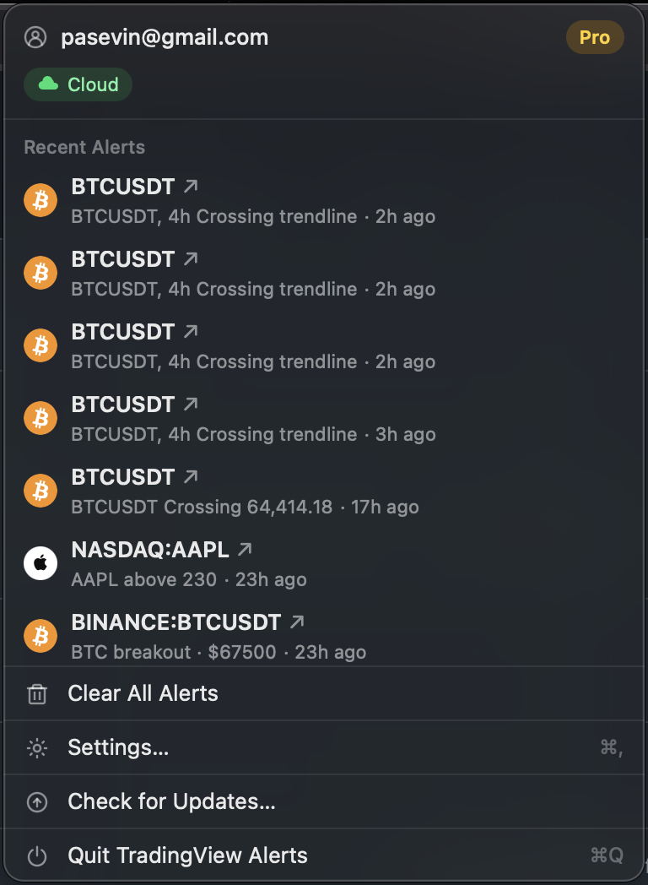
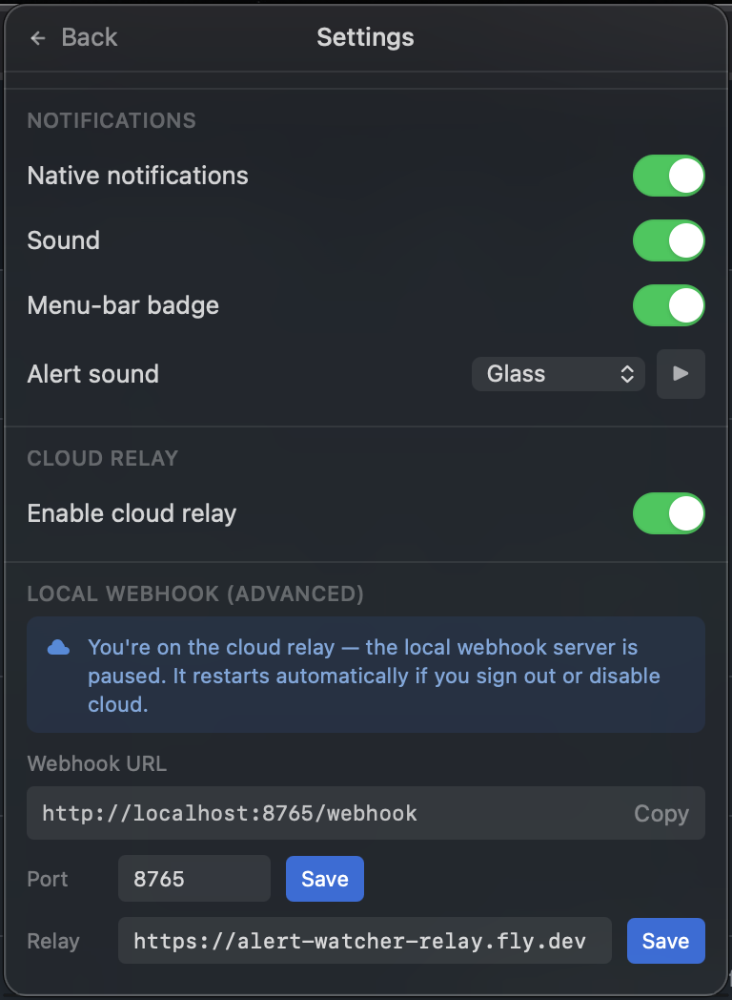

# TradingView Alerts

A native macOS menu-bar app that notifies you the instant your **TradingView
alerts** fire — native notification, menu-bar badge, sound, and a dropdown of
recent alerts. Built on open technology (Tauri 2 + a self-hostable relay), with
no proprietary runtime lock-in.




TradingView sends alerts as webhooks from its cloud, so they need a public URL
to reach your Mac. Three ways to handle that:

| Mode | Setup | Cost |
| --- | --- | --- |
| **Local webhook** | Run your own tunnel (e.g. `ngrok`) to the built-in local server | Free |
| **Self-hosted relay** | Deploy the included relay yourself (no account needed) | Free |
| **Hosted relay (Pro)** | Sign in — your personal URL works the moment you install | Subscription |

The app and the relay are the **same open-source code**. The paid tier is purely
the convenience of a managed, zero-setup hosted relay.

## Architecture

```
TradingView ──HTTPS POST──▶  relay  ──WebSocket──▶  TradingView Alerts (menu bar)
Stripe      ──webhook─────▶  relay  (flips Pro entitlement, pushed live)
```

## Monorepo layout

```
packages/
  protocol/   Zod schemas — the single source of truth for the wire format
  core/       @tvalert/core: a Glaze-shaped facade over Tauri 2 (no lock-in)
apps/
  desktop/    Tauri 2 menu-bar app (React 19 + Radix + Tailwind v4)
  relay/      Fastify + ws + better-sqlite3 + Stripe (self-host or hosted)
```

## Develop

```bash
pnpm install
pnpm --filter @tvalert/protocol --filter @tvalert/core build
pnpm type-check                      # whole workspace
pnpm --filter @tvalert/relay dev     # run the relay locally (self-host mode)
pnpm --filter @tvalert/desktop tauri dev   # run the app (requires macOS + Rust)
```

## Self-host the relay (free, no account)

```bash
cd apps/relay
docker compose up        # REQUIRE_AUTH=false → no accounts, unlimited
```

The app auto-detects the no-auth relay (via `/health`) and skips sign-in.

## License

[AGPL-3.0](LICENSE). Run a modified version as a network service and you must
publish your changes under the same license.
